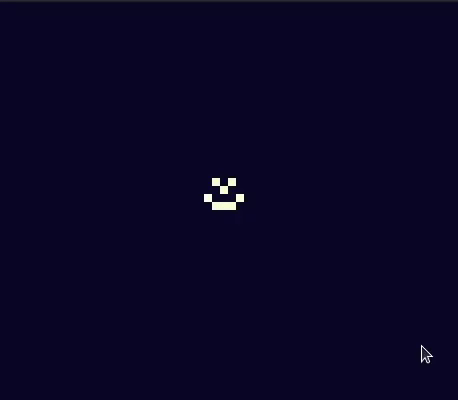
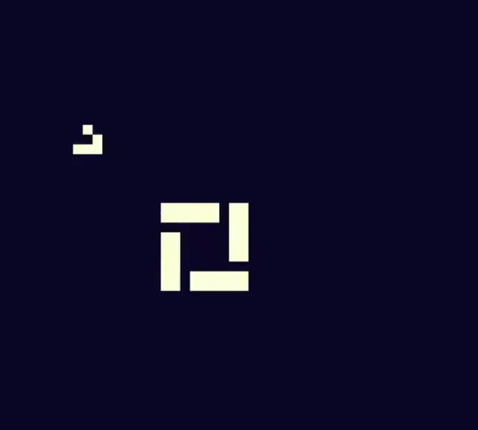

# Custom Rule-Set Cellular Automaton Sandbox

Final Project for Software Design Class at Olin College of Engineering

  

 The aim of this project is to create a sand-box enviorment where a user can not only experience the usual cellular automaton of [Conway's Game of Life](https://en.wikipedia.org/wiki/Conway%27s_Game_of_Life) but also offer the ability for a user to implement custom rulesets in addition to a few other nice custom features. For more info about the project and details on the mathematical backbone of the implementation check the [website out](https://samcabv.github.io/GOL_Sandbox_Softdes/). 
 
 To run the program you'll need a few things, first is running Ubuntu 20.04 Newer (older versions and different distributions of Linux will probably work, these simply have not been tested):
 
 #### Python 3 (Prefferably Anaconda)
 
 The script was written on python so it follows that you'd need it to run it,
 
  `$ sudo apt-get update`
  
  `$ sudo apt-get install python3.8`
 
 This is a nice guide on how to set it up if you're new [here](https://docs.python-guide.org/starting/install3/linux/)
 
 #### Pygame
 
 Pygame is the graphical engine of the program and enables us to quickly create visuals that are easy to interact with, to download it run:

  `$ python3 -m pip install -U pygame --user`
  
  For more info on pygame installation check this link out(https://www.pygame.org/wiki/GettingStarted)
  
  ### Running the program
  
  Once all the dependancies are set, clone this repository using:
  
  `$ git clone https://github.com/SamCabV/GOL_Sandbox_Softdes.git`
  
  Once this is done, to run the program simply type into your terminal:
  
  
  `$ python3 main.py`
  
  Instructions on interacting the program are found in the splash-screen of the program once its booted up. 
