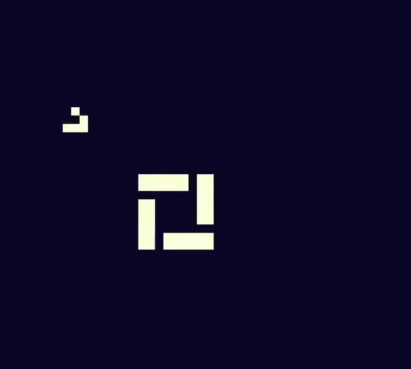

## Welcome to My Custom-Ruleset Cellular Automaton Sandbox 

Originally inspired by the desire to implement [Conway's Game of Life](https://en.wikipedia.org/wiki/Conway%27s_Game_of_Life) (GOL) in pygame, this project grew to encompass not only Game of Life but gives the user ability to implement similar cellular automaton rule sets in-app. 

### Here Are Some Cool Examples of What Sort of Emergent Behaviors GOL and other Cullular Automaton this program enables the user to create

## What Is Conway's Game of Life? 

### Invented by Group Theory legend [John h. Conway](https://en.wikipedia.org/wiki/John_Horton_Conway), Game of Life seminal to the creation and study of Cellular Automata. Cells in GOL can either ba alive or dead, with a board having to be populated before the game can be played, once a board is populated each cell follows these four rules: 

1. Any live cell with fewer than two live neighbours dies, as if by underpopulation.
2. Any live cell with two or three live neighbours lives on to the next generation.
3. Any live cell with more than three live neighbours dies, as if by overpopulation.
4. Any dead cell with exactly three live neighbours becomes a live cell, as if by reproduction

Simple rules like this lead to beautiful and complex patterns and behavior, known as "emergent behaviors" of the system. The idea of this sandbox is to let a user not only explore GOL, but also implement their own conditions for cells to be born and die.

## User Interface

Navigating the program is simple, once loaded chooe between original GOL, GORB which stands for Game of Random Buisness, which just implements a ruleset randomly, and Custom where you can input (ALPHA) (or how many neihbors it takes for a live cell to survive a generation) and (DELTA) (or how many neihbors it takes for a dead cell to come to life), these values are explained more in detail later in the website. 

Start Soup starts a randomized board, start draw starts a blank board for a user to draw on which is as simple as: 

click to draw a live cell, click on a live cell to "delete" it. Once done simply press space and your set.

Once loaded, space will play and pause the simulation, and left and right arrow keys enable a user to step one generation forward and backwards at a time, which leads to some pretty cool play-rewind visuals like this: 

## How does this all work? 

Implementing game of life is a fairly straight-forward process which can be implemented in through a variety of ways and paradigms, generalizing GOL is a bit more involved but still fairly approachable, the following was my process in building the mathematical background before actually implementing anything. 

### State Machine Diagram

Having a bit more experience in hardware, my first instinct when approaching this problem was to construct a flow diagram of the problem which took the base GOL rules and condensed them into this: 

### Moore Automaton Diagram 

Since we are dealing with a simple binary state machine, it could be useful to take this flow diagram and convert it into a moore automaton [(more details about this mathematical tool)](https://en.wikipedia.org/wiki/Moore_machine) , in which we define two states, dead and alive, with output of 0 and 1 respectivly and who transition based on the rules laid in the previous diagram, as such: 

### Abstracted Cell Diagram 

Now that we have defined a cell, we can abstract it and look at it as a nine-input function, these being the state of each of its neighbors, and its own state, as such: 

### Grid Diagram 

Now we can define a GOL board as a grid of cells, who are all connected to each cell they are adjacent to, such that for an **MxN** grid, with each cell defined as a set of points **(m,n)**, we can now define a grid as:

This definition is also helpful for the creation of each cell as now the inputs for a given cell **(m,n)** are defined as **(m-1,n+1),(m,n+1),(m+1,n+1),(m+1,n),(m+1,n-1),(m,n-1),(m-1,n-1),(m-1,n)**.

## Now what?

All of this work goes beyond simply implementing GOL, the power of these diagrams comes from the observation that the transition conditions in the Moore Automaton are actually just sets of numbers, which means that this diagram can be futher generalized to:

Now for any set of integers between 0-8 α defines the number of neihbors a live cell must have to live to another generation and δ represents the number of neihbors a dead cell must have to be born. It is important to mention the choice for α and δ are totally arbitary, I just like how the symbols look :^).  

### Support or Contact

Having trouble with Pages? Check out our [documentation](https://docs.github.com/categories/github-pages-basics/) or [contact support](https://github.com/contact) and we’ll help you sort it out.
